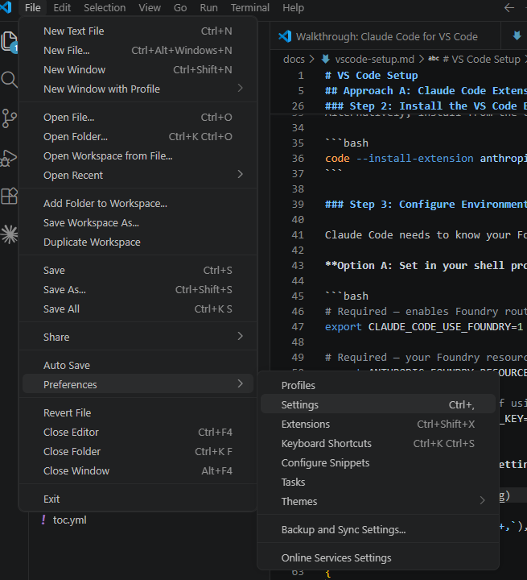
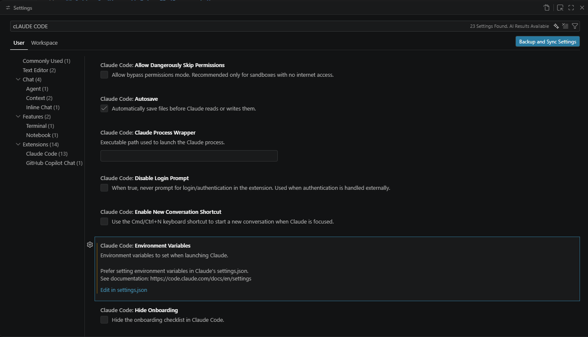

# VS Code Setup

There are three ways to use Claude models from Microsoft Foundry in VS Code. This guide covers each approach.

## Approach A: Claude Code Extension (Recommended)

The Claude Code VS Code extension gives you a full agentic coding experience connected directly to your Foundry resource. This is the recommended approach for development workflows.

### Step 1: Install Claude Code CLI

**Windows (PowerShell):**

```powershell
irm https://claude.ai/install.ps1 | iex
```

**macOS / Linux:**

```bash
curl -fsSL https://claude.ai/install.sh | bash
```

> [!NOTE]
> On Windows, Claude Code CLI requires **Git Bash** (included with [Git for Windows](https://git-scm.com/download/win)) or **WSL2**. The standard Command Prompt and PowerShell are supported for installation, but the CLI itself runs in a bash-compatible shell.

### Step 2: Install the VS Code Extension

1. Open VS Code
2. Go to the **Extensions** view (`Ctrl+Shift+X`)
3. Search for **Claude Code**
4. Install the extension published by **Anthropic**

Alternatively, install from the command line:

```bash
code --install-extension anthropic.claude-code
```

### Step 3: Configure Environment Variables

Claude Code needs to know your Foundry resource name and (optionally) your API key.

**Option A: Set in your shell profile** (applies to terminal and CLI usage):

```bash
# Required — enables Foundry routing
export CLAUDE_CODE_USE_FOUNDRY=1

# Required — your Foundry resource name (not the full URL)
export ANTHROPIC_FOUNDRY_RESOURCE="your-resource-name"

# Optional — API key (omit if using Entra ID)
export ANTHROPIC_FOUNDRY_API_KEY="your-api-key"
```

**Option B: Set in VS Code settings** (applies to the extension only):




Open VS Code settings (`Ctrl+,`), search for **Claude Code**, and add environment variables:

```json

{
  "claudeCode.envVars": {
    "CLAUDE_CODE_USE_FOUNDRY": "1",
    "ANTHROPIC_FOUNDRY_RESOURCE": "foundry-resource-name",
    "ANTHROPIC_FOUNDRY_API_KEY": "your-api-key",
    "DISABLE_PROMPT_CACHING_<ClaudeModel>": "1"
  }
}


For newer version of VS Code, it may look something like this
{
    "claudeCode.preferredLocation": "panel",
    "claudeCode.environmentVariables": [
        {
            "name": "CLAUDE_CODE_USE_FOUNDRY",
            "value": "1"
        },
        {
            "name": "ANTHROPIC_FOUNDRY_RESOURCE",
            "value": "foundry-resource-name"
        },
        {
            "name" : "DISABLE_PROMPT_CACHING_<ClaudeModel>" e.g. "DISABLE_PROMPT_CACHING_HAIKU",
            "value" : "1"
        }
    ],
    "claudeCode.useTerminal": true,
    "terminal.integrated.mouseWheelScrollSensitivity": 3
}
```

### Step 4: Pin Model Deployments (Optional)

If you deployed models with custom deployment names, or want to pin specific model versions:

```bash
export ANTHROPIC_DEFAULT_SONNET_MODEL="claude-sonnet-4-6"
export ANTHROPIC_DEFAULT_HAIKU_MODEL="claude-haiku-4-5"
export ANTHROPIC_DEFAULT_OPUS_MODEL="claude-opus-4-7"
```

### Step 5: Verify the Connection

1. Open VS Code
2. Click the **Spark icon** in the sidebar to open the Claude Code panel
3. Type `/status` in the Claude Code input
4. Confirm the output shows **API provider: Microsoft Foundry**

If the status shows a different provider, double-check your environment variables and restart VS Code.

### Using Entra ID with Claude Code

If you prefer keyless authentication:

1. Sign in with the Azure CLI:

   ```bash
   az login
   ```

2. Set only these environment variables (no API key needed):

   ```bash
   export CLAUDE_CODE_USE_FOUNDRY=1
   export ANTHROPIC_FOUNDRY_RESOURCE="your-resource-name"
   ```

3. Claude Code automatically detects your Azure CLI session and uses Entra ID tokens.

4. Using claude in VS Code Terminal
  - In VS Code, add a new Terminal (PowerShell).
  - To use the model use the command
    ```powershell
    claude --model <deployment-model>
    ```
    example
    ```powershell
    claude --model claude-opus-4-6
    ```
    
    
> [!TIP]
> If your Foundry resource is in a different Azure tenant, run `az login --tenant <tenant-id>` before starting VS Code.

### Claude Code Model Roles

Claude Code uses different models for different tasks:

| Role | Recommended Model | Used For |
|---|---|---|
| Primary | `claude-sonnet-4-6` | General coding, editing, conversation |
| Fast | `claude-haiku-4-5` | File reads, quick lookups, lightweight tasks |
| Extended thinking | `claude-opus-4-7` | Complex reasoning, architecture decisions, debugging |

You can switch models during a session using the `/model` command.

---

## Approach B: Foundry Toolkit Extension

The Foundry Toolkit (formerly "AI Toolkit for VS Code") lets you browse and use models from your Foundry project directly in VS Code, including in **GitHub Copilot Chat**.

### Step 1: Install the Extension

1. Open VS Code
2. Go to **Extensions** (`Ctrl+Shift+X`)
3. Search for **Foundry Toolkit** (or "AI Toolkit")
4. Install the extension published by **Microsoft**

### Step 2: Sign In and Connect

1. Open the Foundry Toolkit panel from the sidebar
2. Sign in with your Azure account
3. Select your Foundry project

Your deployed Claude models appear in the extension's model list.

### Step 3: Use in Copilot Chat

Once connected, your Foundry-hosted Claude models appear as options in the **GitHub Copilot Chat model picker**:

1. Open Copilot Chat (`Ctrl+Shift+I`)
2. Click the model selector dropdown at the top of the chat
3. Select your Claude model from the Foundry section

This approach routes requests through your Azure subscription rather than GitHub's hosting, giving you control over billing and data residency.

---

## Approach C: GitHub Copilot with Claude (Native)

GitHub Copilot also offers Claude models natively through GitHub's own hosting. This does **not** use your Foundry resource.

1. Open Copilot Chat (`Ctrl+Shift+I`)
2. Click the model selector dropdown
3. Choose a Claude model (e.g., Claude Sonnet 4, Claude Opus 4.7)

> [!NOTE]
> Native Copilot Claude models are billed through your GitHub Copilot subscription using premium request multipliers. This is separate from your Azure billing.

---

## Comparison

| Feature | Claude Code Extension | Foundry Toolkit | GitHub Copilot (Native) |
|---|---|---|---|
| **Agentic coding** | Full agent with file editing, terminal, search | Chat only | Chat + inline completions |
| **Uses your Foundry resource** | Yes | Yes | No |
| **Billing** | Azure subscription | Azure subscription | GitHub Copilot subscription |
| **Auth options** | API key or Entra ID | Azure account | GitHub account |
| **Model selection** | All deployed Claude models | All deployed models | GitHub-hosted models |
| **Extended thinking** | Yes | Limited | Limited |

## Troubleshooting

### Claude Code shows wrong API provider

Verify `CLAUDE_CODE_USE_FOUNDRY=1` is set and restart VS Code. Environment variables set in the shell profile require a full VS Code restart (not just reload window).

### "Unauthorized" errors

- **API key auth**: Verify `ANTHROPIC_FOUNDRY_API_KEY` matches the key from your Foundry project
- **Entra ID auth**: Run `az login` and ensure your account has the **Azure AI User** role on the Foundry resource

### Model not found

Ensure the model is deployed in your Foundry project. The model ID in your environment variables must match the deployment's model ID exactly (e.g., `claude-sonnet-4-6`, not `Claude Sonnet 4.6`).

### Rate limit errors

Non-enterprise subscriptions may have 0 RPM / 0 TPM defaults. File a quota increase request through the Azure portal: **Foundry resource** > **Quotas** > **Request increase**.

## Next Steps

- [API Access](api-access.md) — Call Claude from applications using SDKs
- [Authentication](authentication.md) — Detailed auth configuration
